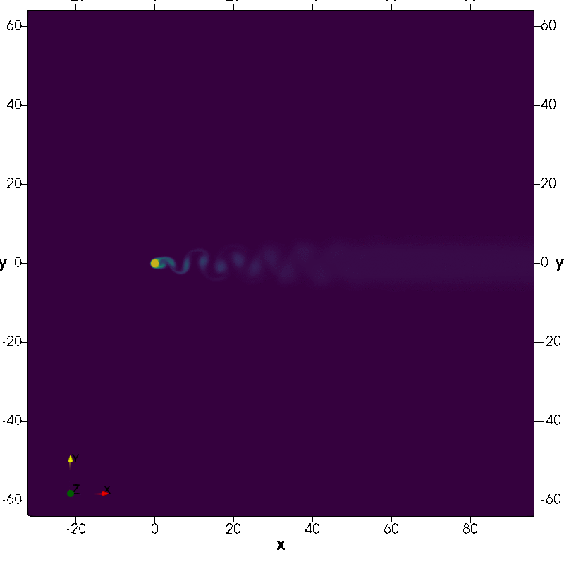

# SDFIBM
An implementation of immersed boundary method in OpenFOAM v6 for simulating fluid-solid interactions.

-----------

# Installation
Requirement: C++11 compiler and OpenFOAM v6.

## Step 1 OpenFOAM
Following the official [installation guide](https://www.openfoam.org), also please test afterwards by running some serial and parallel tutorial cases to ensure a working installation.

## Step 2 Compilation
Whether you are using your personal computer or using HPC, simply get the code
```bash
git clone https://github.com/ChenguangZhang/sdfibm.git
```
Then
```bash
cd sdfibm/src
make
```
The compiled binary is `sdfibm` under the `src` directory. You can soft-link it to your desire location.  
For example, if the sdfibm is installed under home directory:
```
export PATH=$PATH:~/sdfibm/src
```
Then source bash
```
source ~/.bashrc
```

# Important
## 2D simulation
2D mesh in OpenFOAM is really one-layer-thick 3D mesh. SDFIBM requires that the "thickness direction" must be in $z$, so the 2D plane is a $x$-$y$ plane. In addition, the $z$-span of the mesh must be $[-0.5,0.5]$.


# Example
You can see an example in the [example](./example) folder, it include the 2D "flow past cylinder" case at $Re=200$ (animation below), the Taylor-Couette flow with movable core, and a settling ellipse in a rectangular container.



# Code files
- `libshape` contains shape definitions using SDF
    - `ishape.h` the virtual base class all shapes inherit from. It also contains many SDF transformation and Boolean utilities
    - `shapefactory.h` implement the factory design pattern, it holds a library of shapes that are used in the `SolidCloud` class
    - `template.h` a heavily annotated template for creating new shapes, place to change are marked by `CHANGE`
    - `circle.h` a circle of radius $r$
    - `ellipse.h` an ellipse of radius $ra$ and $rb$
    - `kernel.h` legacy code for volume fraction calculation in square/cubic Cartesian mesh
- `libmotion` contains motion constraints. A rigid body has six degrees of freedom (linear velocity in $x$, $y$, $z$, and angular velocity in $x$, $y$, $z$), correspondingly many of the file names contains six digits of `[0,1,2]`. The convention is: 0 if the DOF is killed, 1 if it is free (i.e., unconstrained), and 2 if the DOF is prescribed.
    - `imotion.h` the virtual base class all motions inherit from.
    - `motion01mask.h` generic 0-1 mask of the degrees of freedom. It largely supersedes other files whose name contains 01 strings.
- `libcollision` for collision detection, currently under development
- `solidcloud.h (.cpp)` the main class. It holds record of all solids and is responsible for reading the input, creating the shape/motion/material library, interacting with the fluid, and storing data into the `cloud.out` output file
- `solid.h` corresponds to the individual solid. It keeps and updates the kinematic and dynamic information of a solid. It also holds pointers to shape/motion/material instances obtained from the corresponding libraries in the `SolidCloud` class.
- `main.cpp` implements the projection method and the direct forcing IBM

# Result file
The particle simulation result is saved in the cloud.out file.

There are 19 columns.
> names = ["t", "x", "y", "z", "vx", "vy", "vz", "fx", "fy", "fz", "EulerAx", "EulerAy", "EulerAz", "wx", "wy", "wz", "Tx", "Ty", "Tz"]

In words, they are:  
> Time, position-x, position-x, position-z, velocity-x, velocity-y, velocity-z, force-x, force-y, force-z, Euler_angle-x, Euler_angle-y, Euler_angle-z, angular_velocity-x, angular_velocity-y, angular_velocity-z, torque-x, torque-y, torque-z


# How to Cite
Please cite the following paper if you use this code, thanks!

Chenguang Zhang, Chunliang Wu, and Krishnaswamy Nandakumar. Effective geometric algorithms for immersed boundary method using signed distance field. Journal of Fluids Engineering, 141(6):061401, 2019.


# TODO
- [X] AMR
- [X] Collision detection and resolution

# License
Under [GPLv3 License](https://opensource.org/licenses/GPL-3.0).
