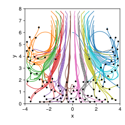
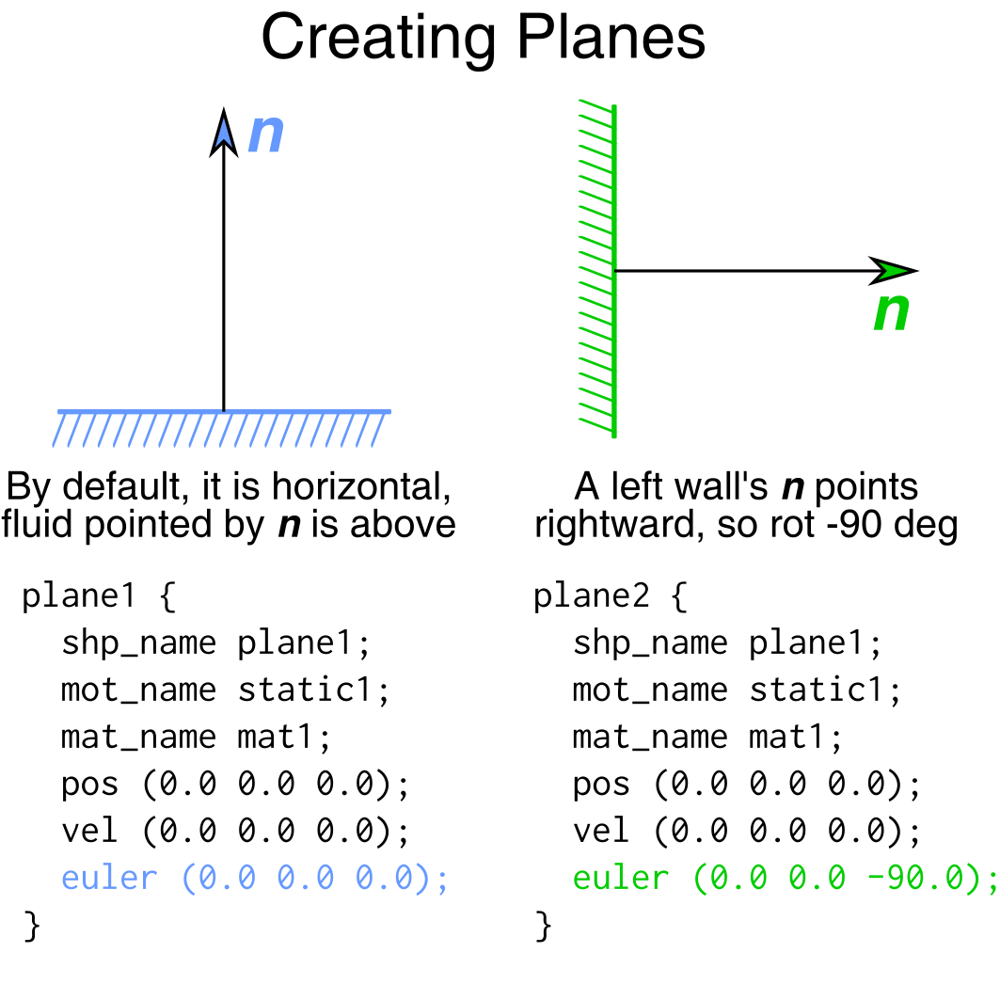
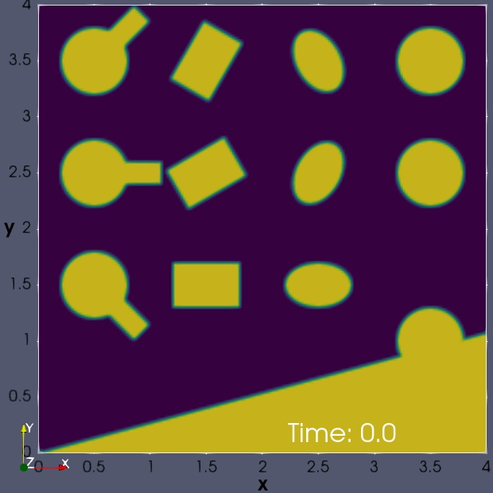
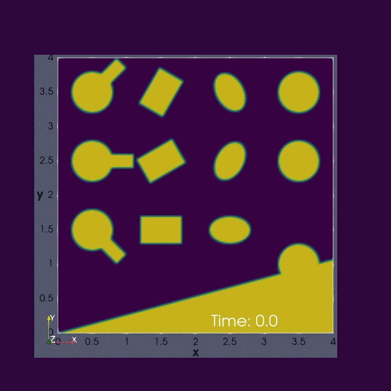
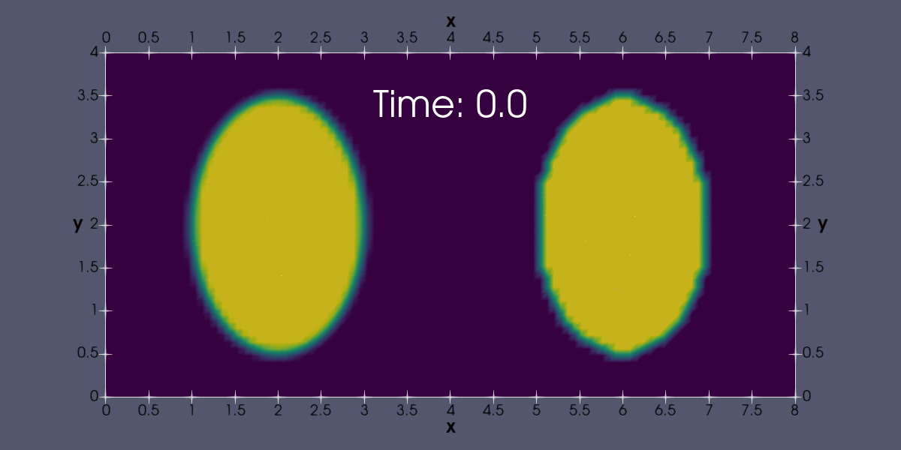
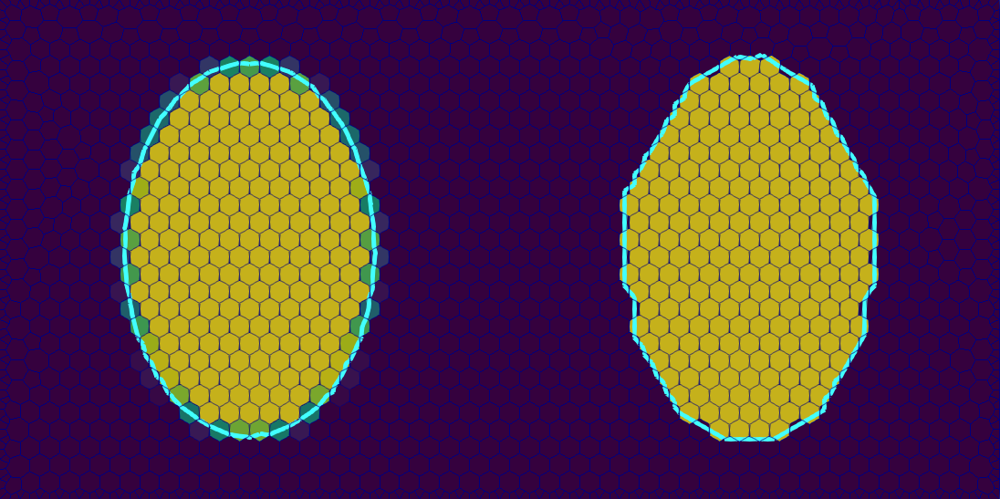

# sdfibm
An immersed boundary method for simulating fluid-solid interaction and particle-laden multiphase flows.

-----------

# Installation
Requirement: `g++` with `C++11` support and OpenFOAM v6. Other compilers weren't tested but should work.

*Step 1*, follow the official [guide](https://www.openfoam.org) to install OpenFOAM v6. Test afterwards to ensure a working installation (e.g., by running some serial and parallel tutorial cases).

*Step 2*, whether on your laptop or HPC cluster, simply type three commands.

```bash
git clone https://github.com/ChenguangZhang/sdfibm.git
cd sdfibm/src
make
```
The solver binary is `./src/sdfibm`. It is recommended that you soft-link it to a system-wide path (e.g., `sudo ln -s ~/sdfibm/src/sdfibm /usr/local/bin/sdfibm`), then you can simply type `sdfibm` to run a simulation without specifying the whole binary path.
## Important!

- The convention of coordinate system is that we face the $x$-$y$ plane, with $z$-axis pointing towards us.

- A 2D simulation uses a one-cell-thick 3D mesh, `sdfibm` mandates that the "thickness direction" is in $z$ and the $z$-span of the mesh is $[-0.5,0.5]$. In other words, the 2D dynamics occurs exactly on the $z=0$, aka the $x$-$y$ plane. 


# Included examples
Cases under the [example](./examples) folder are some good starting points of using the code. That include

- 2D "flow past cylinder" at $Re=200$ (animation below)


- the Taylor-Couette flow with a rotational core. A MATLAB finite-difference script is also there, which solves a reduced-order PDE that validates sdfibm

- an ellipse that wobbles and settles in a rectangular container

- `./examples\sedimentation` is a case where 100 circular particles settle in a square container (a video version you can pause is here https://www.youtube.com/watch?v=C6U9X9zatz8). 

  

  The particle trajectories below clearly show the circulation caused by the counter flow.

  

## Creating planes

The plane definition (e.g., in the sedimentation case) can be a bit confusing, especially its orientation. We know a plane is specified by an on-plane point $\boldsymbol p$ (`pos` below) and a direction $\boldsymbol n$.  $\boldsymbol p$ does not matter much as long as it's on the plane. Regarding $\boldsymbol n$, our convention is that **it points into the fluid**. By default (i.e., no rotation or translation), the plane is the $x$-$z$  plane (like the flat ground), with $\boldsymbol n$ pointing upward, so fluid is above the plane. 

If we want to make a left wall---meaning the fluid is to its right---then $\boldsymbol n$ must be point rightwards, which in turn means we need to rotate the plane clockwise 90 &deg, or -90 &deg (I believe everybody agrees that clockwise rotation has a negative angle). Similarly, to make a right wall we have to rotate it positive 90 &deg. Lastly, if the left wall is at, say, $x=-10%$, you also need to set the `pos` variable to $(-10, y, z)$. Remember, the only requirement of `pos` is that it is on the plane, so $y$ and $z$ values do not really matter here. 



# Smooth VOF Initialization

Not directly related with immersed boundary method, a tool is created to smoothly initialize the phase field of VOF simulations. The word "smooth" here is essential when simulating low Capillary number flows. The simplest method (as used by `setFields`) that simply sets the phase fraction at mesh cells to 0/1 creates a staircase phase interface, which generates capillary waves that pollute the simulation easily. My tool initializes the VOF phase field accurately and smoothly. The image below is the initialized field of the (2D) `./tool_vof/example` case, which shows

1. the various shapes can be used
2. the shapes can overlap each other (see lower right)



The case is ready for `interFoam` and can be run right after initialization. The result is below. As expected, the droplet oscillations are smooth without anything spurious.



The animation below compares smooth (left) vs. staircase (right) initializations, using the oscillation of inviscid 2D elliptical droplets ($T=1$). The left one used our VOF tool, the right one used `setFields` of OpenFOAM---there the spurious capillary waves caused by the staircase boundary are clearly visible. Even those waves appear diminished later on, they are hard to control or separate from the physical results. Thus, the left simulation is strongly preferred.



Lastly, the tool works with arbitrary polyhedron meshes, see figure below (left: current too, right: `setFields`, contoured value: 0.5).



# Code files

- `libshape` contains shape definitions using SDF
    - `ishape.h` the virtual base class all shapes inherit from. It also contains many SDF transformation and Boolean utilities
    - `shapefactory.h` implement the factory design pattern, it holds a library of shapes that are used in the `SolidCloud` class
    - `template.h` a heavily annotated template for creating new shapes, place to change are marked by `CHANGE`
    - `circle.h` a circle of radius $r$
    - `ellipse.h` an ellipse of radius $ra$ and $rb$
    - `kernel.h` legacy code for volume fraction calculation in square/cubic Cartesian mesh
- `libmotion` contains motion constraints. A rigid body has six degrees of freedom (linear velocity in $x$, $y$, $z$, and angular velocity in $x$, $y$, $z$), correspondingly many of the file names contains six digits of `[0,1,2]`. The convention is: 0 if the DOF is killed, 1 if it is free (i.e., unconstrained), and 2 if the DOF is prescribed.
    - `imotion.h` the virtual base class all motions inherit from.
    - `motion01mask.h` generic 0-1 mask of the degrees of freedom. It largely supersedes other files whose name contains 01 strings.
- `libcollision` for collision detection, currently only sphere-sphere and sphere-plane
- `solidcloud.h (.cpp)` the main class. It holds record of all solids and is responsible for reading the input, creating the shape/motion/material library, interacting with the fluid, and storing data into the `cloud.out` output file
- `solid.h` corresponds to the individual solid. It keeps and updates the kinematic and dynamic information of a solid. It also holds pointers to shape/motion/material instances obtained from the corresponding libraries in the `SolidCloud` class.
- `main.cpp` implements the projection method and the direct forcing IBM

# Output file
Information of the solid bodies is written to the `cloud.out` file, which has the simple plain text format: if there are $m$ solids and $n$ planes, each time step `sdfibm` writes $m+n$ lines, and each line contains 19 columns.

> names = ["t", "x", "y", "z", "vx", "vy", "vz", "fx", "fy", "fz", "EulerAx", "EulerAy", "EulerAz", "wx", "wy", "wz", "Tx", "Ty", "Tz"]

In words, they are:  
> Time, position-x, position-x, position-z, velocity-x, velocity-y, velocity-z, force-x, force-y, force-z, Euler_angle-x, Euler_angle-y, Euler_angle-z, angular_velocity-x, angular_velocity-y, angular_velocity-z, torque-x, torque-y, torque-z


# How to cite
Cite the following papers if you use this code.

1. Chenguang Zhang, Chunliang Wu, and Krishnaswamy Nandakumar. Effective geometric algorithms for immersed boundary method using signed distance field. Journal of Fluids Engineering, 141(6):061401, 2019.

2. Chenguang Zhang. sdfibm: a Signed Distance Field Based Discrete Forcing Immersed Boundary Method in OpenFOAM. Submitted to Computer Physics Communications (under review, wait for update).

# License 

`sdfibm` is licensed under GNU GENERAL PUBLIC LICENSE ([GPLv3](https://opensource.org/licenses/GPL-3.0)). You can use, copy and modify `sdfibm` freely. If you distribute your software based on (any part of) `sdfibm`, you are obliged to distribute the source code of your software under GPL, in addition to any modifications made to `sdfibm`.

In case the constraints prevent you from using `sdfibm`, you can obtain a commercial license by contacting me.

# Misc.

I prefer 🍔 to coffee if you want to brighten my day :) [](https://www.paypal.com/cgi-bin/webscr?cmd=_donations&business=BWVSQXJKTRGSJ&currency_code=USD&source=url)

To check the version of your `sdfibm` repository, use `git log -1`. The minus one means the latest commit.